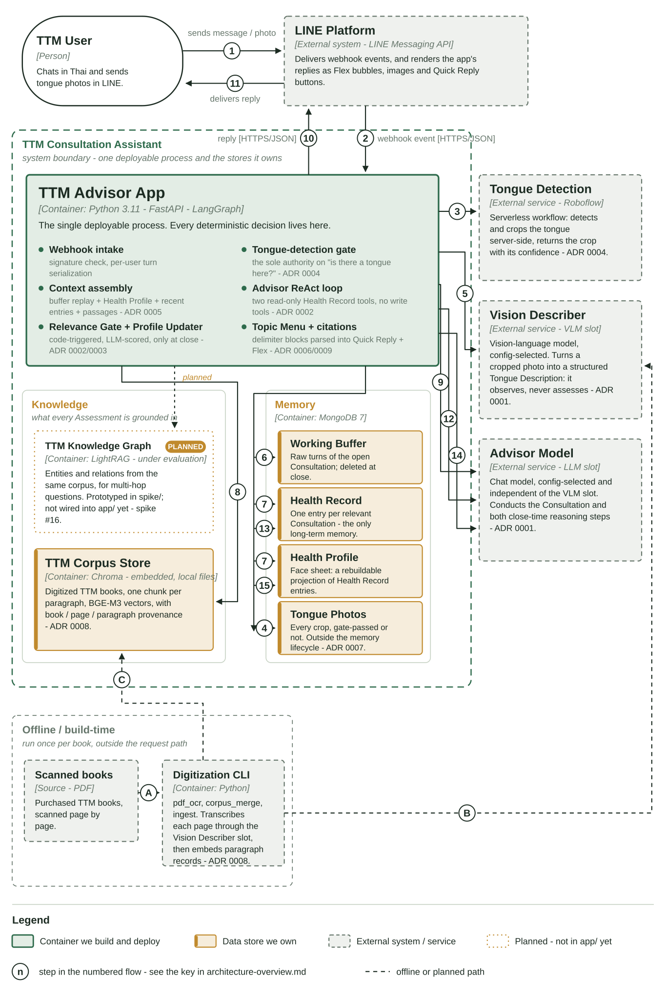

# Architecture overview

The system-overview figure for the thesis: a C4 **container-level** diagram of the
TTM Consultation Assistant. It answers *what is deployed and what talks to what* —
for the conditional decision logic of a single message, see
[message-flow.md](message-flow.md), which is a different diagram on purpose.



Two renderings are committed, both from the same source:

| File | Use |
|---|---|
| `architecture-overview.svg` | vector — LaTeX (`\includegraphics`), web, further editing |
| `architecture-overview.png` | 1890 × 2835 px = 160 mm wide at 300 dpi — drop straight into Word |

Both are sized for a **full A4 portrait page** at 160 mm text width. At that size the
box titles print at about 8.5 pt and the descriptions at about 6 pt. Printing it
smaller than a full page will not be readable.

Regenerate after any edit:

```bash
uv run python scripts/build_architecture_diagram.py
uv run python -c "import cairosvg; cairosvg.svg2png(url='docs/architecture-overview.svg', write_to='docs/architecture-overview.png', scale=1.1524)"
```

## Caption — ready to paste into the thesis

> **Figure 3.1  Overview of the TTM Consultation Assistant architecture.**
> The system is a single deployable process (TTM Advisor App) that owns every
> deterministic decision: webhook intake, the tongue-detection confidence gate,
> context assembly, the Advisor's tool loop, and the two close-time memory steps.
> Three external services sit outside the boundary — a Roboflow workflow that
> detects and crops the tongue, a Vision Describer (VLM) slot that converts the
> crop into a structured Tongue Description, and an Advisor Model (LLM) slot that
> conducts the Consultation. Neither model slot is fixed by the architecture; both
> are selected by configuration (ADR 0001). Inside the boundary the app owns two
> kinds of state: **knowledge**, an embedded Chroma store holding the digitized TTM
> corpus with book / page / paragraph provenance, and **memory**, a MongoDB
> database holding the Working Buffer, Health Record, Health Profile, and the
> Tongue Photo dataset. Numbered arrows give the order of one message turn;
> steps 12–15 fire later, at Consultation close. Dashed boxes and paths are either
> external to the system or not yet implemented.

## Key to the numbered arrows

### Runtime — one message turn

| # | From → To | What happens |
|---:|---|---|
| 1 | User → LINE Platform | User sends a Thai message or a tongue photo |
| 2 | LINE Platform → App | LINE delivers the webhook event  `[HTTPS/JSON]` |
| 3 | App → Tongue Detection | App has the tongue detected and cropped — image turns only  `[HTTPS/JSON]` |
| 4 | App → Tongue Photos | App persists every crop returned, gate-passed or not (ADR 0007) |
| 5 | App → Vision Describer | App has the crop described as a Tongue Description  `[HTTPS/JSON]` |
| 6 | App ↔ Working Buffer | App reads the open Consultation's turns and appends the new one |
| 7 | App → Health Record / Health Profile | App reads the face sheet and the recent entries — one step, two stores, so the badge appears twice |
| 8 | App → TTM Corpus Store | App retrieves grounded passages  `[in-process, BGE-M3]` |
| 9 | App → Advisor Model | App consults the Advisor: ReAct loop with two read-only record tools  `[HTTPS/JSON]` |
| 10 | App → LINE Platform | App replies in Thai: Flex bubble, echoed photo, Topic Menu  `[HTTPS/JSON]` |
| 11 | LINE Platform → User | LINE delivers the reply |

### Consultation close — fires on the next message after a >6 h gap

| # | From → To | What happens |
|---:|---|---|
| 12 | App → Advisor Model | App scores relevance and summarizes the closed Consultation  `[HTTPS/JSON]` |
| 13 | App → Health Record | App writes the entry — only if the Relevance Gate passes (ADR 0002) |
| 14 | App → Advisor Model | App requests an item-level Health Profile patch  `[HTTPS/JSON]` |
| 15 | App → Health Profile | App applies the patch against stable item IDs (ADR 0003) |

The close-time steps reach the **same** Advisor Model endpoint as step 9 — that is
one external service with three callers, not three services. Drawing them as
separate boxes would misstate what is deployed.

### Offline / build-time

| # | From → To | What happens |
|---:|---|---|
| A | Scanned books → Digitization CLI | Scanned page images go to the digitization pipeline |
| B | Digitization CLI → Vision Describer | CLI transcribes each page through the VLM slot |
| C | Digitization CLI → TTM Corpus Store | CLI embeds paragraph records, with provenance, into Chroma (ADR 0008) |

## What the figure deliberately leaves out

A container diagram states what is deployed; these belong elsewhere and would only
crowd it out:

- **Conditional decision logic** — "tongue found?", "health content?", "call a
  tool?" live in [message-flow.md](message-flow.md).
- **The LINE delivery degrade ladder** — reply → push → Flex-less → plain text with
  the citation folded inline (ADR 0007, ADR 0009).
- **In-process mechanics** — the per-user lock, the loading animation, the
  background task, and BGE-M3 itself, which is a library call inside the app rather
  than a service (it is named on arrow 8 instead of given a box).
- **Which models currently fill the slots** — that is `.env`, not architecture. See
  [ADR 0001](adr/0001-two-model-pipeline.md).

## One box is not built yet

**TTM Knowledge Graph** is drawn dotted and tagged `PLANNED` because it is exactly
that. It exists as a LightRAG prototype under `spike/` (288 entities, 403 relations
extracted from one book) and is *not* referenced anywhere in `app/`. Production
retrieval today is flat vector search over the Chroma corpus store. If the graph is
dropped after evaluation, delete the box and arrow rather than leaving a claim the
code does not support.
