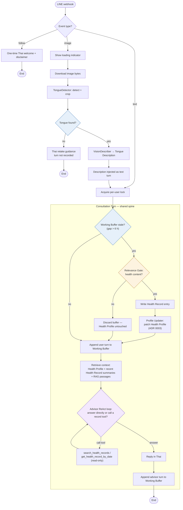

# Message Flow

How the TTM advisor handles each kind of incoming LINE message, and who
makes each decision along the way. Blue diamonds are decided by
deterministic code, the amber diamond is code-triggered but LLM-scored,
and the purple diamond is the Advisor Model's own agentic choice.
The Health Profile write path is defined by [ADR 0003](adr/0003-health-profile-projection.md).

## The three decision diamonds

| Decision | Decider | Kind |
|---|---|---|
| Tongue found? | `TongueDetector` (`app/vision/detector.py`) | Deterministic |
| Health content? | Relevance Gate at Consultation close (`app/memory/relevance_gate.py`) | Deterministic trigger, LLM-scored |
| Need past records? | Advisor Model in the ReAct loop (`app/advisor/graph.py`) | Agentic |

The Profile Updater adds no fourth diamond: it runs if and only if the
gate passes — one boundary guards both long-term memory writes.

## Branch notes

**`follow`** — a one-time Thai welcome and disclaimer is sent
(`app/pipeline/dispatcher.py`); nothing is stored.

**`text`** — the per-user lock serializes turns, then the shared spine
runs: close a stale [Consultation](../CONTEXT.md) if one is waiting,
append the turn to the [Working Buffer](../CONTEXT.md), retrieve context,
run the Advisor, reply in Thai.

**`image`** — tongue detection is a deterministic pipeline step that runs
*before* the agent ([ADR 0001](adr/0001-two-model-pipeline.md)): the
[Vision Describer](../CONTEXT.md) only describes; the Advisor makes the
[Tongue Assessment](../CONTEXT.md). No detected tongue → retake guidance,
never an Assessment, and the turn is not recorded.

**Consultation close** — lazy, inside webhook handling: when a message
arrives after a >6 h gap (config default), the stale buffer meets the
[Relevance Gate](../CONTEXT.md)
([ADR 0002](adr/0002-health-record-only-memory.md)). Health content →
a [Health Record](../CONTEXT.md) entry is written, then the
[Profile Updater](../CONTEXT.md) folds that entry into the
[Health Profile](../CONTEXT.md) as item-level patches — adding, updating,
or clearing items such as [Ongoing Complaints](../CONTEXT.md)
([ADR 0003](adr/0003-health-profile-projection.md)).
No health content → everything is discarded and the Health Profile is
untouched. This is the only write path to long-term memory. The Advisor
has no write tools — its only tools are the two read-only record tools.
