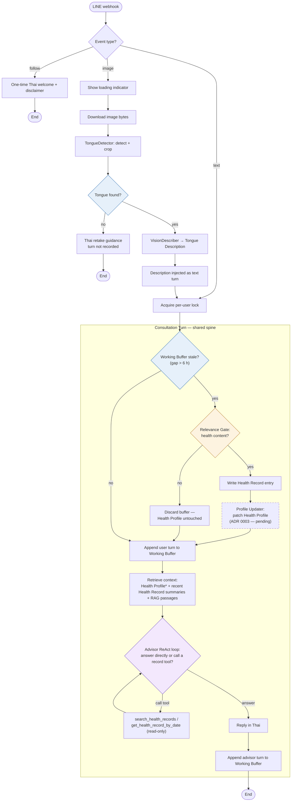

# Message-Flow Visualization Implementation Plan

> **For agentic workers:** REQUIRED SUB-SKILL: Use superpowers:subagent-driven-development (recommended) or superpowers:executing-plans to implement this plan task-by-task. Steps use checkbox (`- [ ]`) syntax for tracking.

**Goal:** Build both deliverables of the approved message-flow visualization spec: a Mermaid decision map in `docs/message-flow.md` and a self-contained interactive HTML page `docs/message-flow.html`, each rendering the same canonical map of how the TTM advisor handles every kind of LINE message.

**Architecture:** One canonical decision map (defined verbatim in this plan, derived from `app/pipeline/dispatcher.py` + ADR 0003) is rendered twice: Task 1 embeds it as a Mermaid flowchart with prose; Task 2 hand-draws it as inline SVG with a vanilla-JS scenario picker. Tasks 1 and 2 are fully independent — dispatch to two separate agents in parallel (use worktree isolation to avoid commit races, or run sequentially in-place). Task 3 runs in the main session afterward: publish the HTML via the Artifact tool and verify interactively.

**Tech Stack:** Markdown + Mermaid (Deliverable A); hand-written HTML/CSS/SVG/vanilla JS, zero external resources (Deliverable B); `@mermaid-js/mermaid-cli` via `npx` for render-checking.

**Spec:** `docs/superpowers/specs/2026-07-06-message-flow-visualization-design.md` (Approved; revised 2026-07-06 to include the Health Profile flow from ADR 0003).

## Global Constraints

- Nodes and edges must match the code exactly — **no invented nodes**. Health Profile nodes must match `docs/adr/0003-health-profile-projection.md` exactly.
- Health Profile elements are **approved design, implementation pending** — both deliverables must visibly mark them "(ADR 0003 — pending build)" (dashed styling + footnote).
- Exactly **three teaching diamonds**, visually coded by decider: *Tongue found?* (deterministic), *Health content?* (deterministic trigger, LLM-scored), *Need past records?* (agentic). The stale-buffer check renders as a plain deterministic branch, not counted among the three.
- The Profile Updater is a **box on the gate's yes-branch** after the Health Record write — never a diamond (it runs iff the gate passes).
- There is **no save-record tool and no Health Profile tool**; the agent's only tools are read-only `search_health_records` and `get_health_record_by_date`.
- Deliverable B: **self-contained** — no CDN scripts, external stylesheets, fonts, remote images, or network fetches of any kind (`xmlns` attributes are fine). English labels on the map; actual Thai bot messages only inside step notes.
- Six scenarios exactly as listed in the spec's scenario table.
- Mermaid must be render-checked before commit; the HTML must produce no horizontal page scroll.
- Commit messages: conventional commits (`docs: ...`), no attribution footer.
- Consultation gap (6 h) and injection count (3) are config values (`consultation_gap_hours`, `health_record_inject_count`) — label them as defaults, not hard-coded truths.

## Canonical decision map

Both tasks render exactly this map. Node IDs are shared between the Mermaid source and the SVG element IDs so paths can be cross-checked mechanically.

| ID | Kind | Label (English) |
|---|---|---|
| WH | entry | LINE webhook |
| EVT | branch | Event type? |
| WEL | box | One-time Thai welcome + disclaimer |
| END1 | end | End |
| LOCK | box | Acquire per-user lock |
| LOAD | box | Show loading indicator |
| DL | box | Download image bytes |
| DET | box | TongueDetector: detect + crop |
| TF | **diamond, deterministic** | Tongue found? |
| RETAKE | box | Thai retake guidance — turn not recorded |
| END2 | end | End |
| VD | box | VisionDescriber → Tongue Description |
| INJECT | box | Description injected as text turn |
| STALE | branch, deterministic | Working Buffer stale? (gap > 6 h) |
| GATE | **diamond, LLM-scored** | Relevance Gate: health content? |
| REC | box | Write Health Record entry |
| PU | box, **planned/dashed** | Profile Updater: patch Health Profile (ADR 0003 — pending) |
| DISCARD | box | Discard buffer — Health Profile untouched |
| APPEND | box | Append user turn to Working Buffer |
| CTX | box | Retrieve context: Health Profile\* + recent Health Record summaries + RAG passages |
| AGENT | **diamond, agentic** | Advisor ReAct loop: answer directly or call a record tool? |
| TOOLS | box | search_health_records / get_health_record_by_date (read-only) |
| REPLY | box | Reply in Thai |
| APPADV | box | Append advisor turn to Working Buffer |
| END3 | end | End |

Edges (SVG edge IDs use `e-<FROM>-<TO>`): WH→EVT; EVT→WEL (follow); WEL→END1; EVT→LOCK (text); EVT→LOAD (image); LOAD→DL; DL→DET; DET→TF; TF→RETAKE (no); RETAKE→END2; TF→VD (yes); VD→INJECT; INJECT→LOCK; LOCK→STALE; STALE→GATE (yes); GATE→REC (yes); REC→PU; PU→APPEND; GATE→DISCARD (no); DISCARD→APPEND; STALE→APPEND (no); APPEND→CTX; CTX→AGENT; AGENT→TOOLS (call tool); TOOLS→AGENT; AGENT→REPLY (answer); REPLY→APPADV; APPADV→END3.

Thai bot messages (verbatim from `app/pipeline/dispatcher.py:19-27`; step-notes only):

- Welcome: `สวัสดีค่ะ ดิฉันเป็นผู้ช่วยให้คำแนะนำด้านแพทย์แผนไทยเบื้องต้น ไม่ใช่แพทย์และไม่ได้ให้การวินิจฉัยทางการแพทย์ หากมีอาการรุนแรงหรือฉุกเฉิน กรุณาพบแพทย์หรือโทร 1669 ทันที`
- Retake: `ดิฉันมองไม่เห็นลิ้นในภาพนี้ชัดเจนค่ะ ลองถ่ายภาพลิ้นให้เต็มกรอบ แสงสว่างเพียงพอ และภาพไม่เบลอ แล้วส่งมาอีกครั้งนะคะ`

---

### Task 1: Deliverable A — `docs/message-flow.md` (Mermaid map + prose)

**Recommended agent:** `ecc:doc-updater`

**Files:**
- Create: `docs/message-flow.md`
- Modify: `CLAUDE.md` (add a "Message flow" line under `### Domain docs`)
- Test: render-check via `@mermaid-js/mermaid-cli` (no pytest — this is a doc)

**Interfaces:**
- Consumes: nothing from other tasks (reads `app/pipeline/dispatcher.py`, `app/advisor/tools.py`, `app/advisor/graph.py`, `app/memory/relevance_gate.py`, `docs/adr/0003-health-profile-projection.md` for verification only)
- Produces: `docs/message-flow.md` (nothing downstream consumes it programmatically)

- [ ] **Step 1: Write `docs/message-flow.md` with exactly this content**

````markdown
# Message Flow

How the TTM advisor handles each kind of incoming LINE message, and who
makes each decision along the way. Blue diamonds are decided by
deterministic code, the amber diamond is code-triggered but LLM-scored,
and the purple diamond is the Advisor Model's own agentic choice.
Dashed elements are approved design, pending build
([ADR 0003](adr/0003-health-profile-projection.md)).



\* Health Profile injection into context is approved design
([ADR 0003](adr/0003-health-profile-projection.md)), pending build; the
record summaries and RAG passages are live today.

## The three decision diamonds

| Decision | Decider | Kind |
|---|---|---|
| Tongue found? | `TongueDetector` (`app/vision/detector.py`) | Deterministic |
| Health content? | Relevance Gate at Consultation close (`app/memory/relevance_gate.py`) | Deterministic trigger, LLM-scored |
| Need past records? | Advisor Model in the ReAct loop (`app/advisor/graph.py`) | Agentic |

The Profile Updater adds no fourth diamond: it runs if and only if the
gate passes — one boundary guards both long-term memory writes.

## Branch notes

**`follow`** — a one-time Thai welcome and disclaimer is sent
(`app/pipeline/dispatcher.py`); nothing is stored.

**`text`** — the per-user lock serializes turns, then the shared spine
runs: close a stale [Consultation](../CONTEXT.md) if one is waiting,
append the turn to the [Working Buffer](../CONTEXT.md), retrieve context,
run the Advisor, reply in Thai.

**`image`** — tongue detection is a deterministic pipeline step that runs
*before* the agent ([ADR 0001](adr/0001-two-model-pipeline.md)): the
[Vision Describer](../CONTEXT.md) only describes; the Advisor makes the
[Tongue Assessment](../CONTEXT.md). No detected tongue → retake guidance,
never an Assessment, and the turn is not recorded.

**Consultation close** — lazy, inside webhook handling: when a message
arrives after a >6 h gap (config default), the stale buffer meets the
[Relevance Gate](../CONTEXT.md)
([ADR 0002](adr/0002-health-record-only-memory.md)). Health content →
a [Health Record](../CONTEXT.md) entry is written, then the
[Profile Updater](../CONTEXT.md) folds that entry into the
[Health Profile](../CONTEXT.md) as item-level patches — adding, updating,
or clearing items such as [Ongoing Complaints](../CONTEXT.md)
([ADR 0003](adr/0003-health-profile-projection.md) — pending build).
No health content → everything is discarded and the Health Profile is
untouched. This is the only write path to long-term memory. The Advisor
has no write tools — its only tools are the two read-only record tools.
````

- [ ] **Step 2: Render-check the Mermaid block**

```bash
TMP=$(mktemp -d)
python3 - "$TMP" <<'EOF'
import re, sys, pathlib
md = pathlib.Path("docs/message-flow.md").read_text()
m = re.search(r"```mermaid\n(.*?)```", md, re.S)
assert m, "no mermaid block found"
pathlib.Path(sys.argv[1], "flow.mmd").write_text(m.group(1))
print("extracted OK")
EOF
npx -y @mermaid-js/mermaid-cli -i "$TMP/flow.mmd" -o "$TMP/flow.svg"
test -s "$TMP/flow.svg" && echo RENDER_OK
```

Expected: `extracted OK` then `RENDER_OK`. If mmdc reports a parse error, fix the Mermaid syntax (most likely an unquoted special character in a node label) and re-run until `RENDER_OK`.

- [ ] **Step 3: Verify every edge against the code**

Read `app/pipeline/dispatcher.py`, `app/advisor/tools.py`, `app/advisor/graph.py`, `app/memory/relevance_gate.py` and check each item; all must hold:

- follow → welcome only (`handle_follow`), nothing stored
- text → lock → spine (`handle_text_message` → `_run_consultation_turn`)
- image → loading → download → detect → (none → retake, not buffered) / (found → describe → inject as text turn → lock → spine) (`handle_image_message`)
- spine order: `pop_if_stale` → gate → conditional insert; then append user turn; then `recent(...)` + `retrieve_passages(...)`; then agent; then append advisor turn
- agent tools are exactly the two read-only tools from `build_health_record_tools`
- Profile Updater edges (REC→PU→APPEND, DISCARD note, CTX asterisk) match ADR 0003 — they will NOT be in the code yet; that is expected and correct per the spec

Expected: every box checked; if any edge disagrees with the code, fix the diagram (never the code) and re-run Step 2.

- [ ] **Step 4: Link from CLAUDE.md**

In `CLAUDE.md`, under the `### Domain docs` section, after the existing line ending with `See docs/agents/domain.md.`, add:

```markdown

### Message flow

The unified decision map for how each LINE message type is handled (and who decides what): `docs/message-flow.md`.
```

Note: `CLAUDE.md` has an unrelated pre-existing uncommitted edit (title `csb_thesis` → `TTMAgent`). It is a correct rename — include it in the commit rather than trying to split hunks.

- [ ] **Step 5: Commit**

```bash
git add docs/message-flow.md CLAUDE.md
git commit -m "docs: add message-flow decision map"
```

---

### Task 2: Deliverable B — `docs/message-flow.html` (interactive SVG map)

**Recommended agent:** `general-purpose` (no ecc agent fits self-contained HTML/SVG artifact building)

**Files:**
- Create: `docs/message-flow.html`
- Test: self-containment grep + scenario/SVG ID consistency script (below)

**Interfaces:**
- Consumes: nothing from other tasks (the canonical map, scenario data, and Thai strings are all in this task)
- Produces: `docs/message-flow.html` for Task 3, with this exact contract:
  - every map node/edge is an SVG element (`<g>` or `<path>`) whose `id` matches the canonical IDs (`WH`, `EVT`, … and `e-WH-EVT`, …)
  - scenario buttons: `<button class="scenario-btn" data-scenario="<id>">` for ids `hello`, `feelings`, `tongue`, `notongue`, `gap`, `firstvisit`
  - `selectScenario(id)` adds class `active` to that scenario's nodes/edges, `dimmed` to all others, and fills `#step-notes` with the scenario's notes as an ordered list
  - repo precedent for committed HTML: `docs/design-decisions.html`

- [ ] **Step 1: Load the `artifact-design` skill** (required by the spec before writing the page), then design within its guidance.

- [ ] **Step 2: Write `docs/message-flow.html`**

Structure (all inline, no external resources):

- `<title>TTM Advisor — Message Flow</title>`, one `<style>` block, one `<script>` block at the end of the body.
- Layout: header with the six scenario buttons in a row (wrapping on small screens); below it a two-column area — the SVG map (left/center, `max-width:100%`, inside an `overflow-x:auto` container) and the step-notes panel (`<aside id="step-notes">`) beside it, stacking underneath on narrow viewports via a media query.
- The SVG map draws the canonical decision map (all 25 nodes, all 28 edges, IDs exactly as listed in "Canonical decision map" above). English labels. Diamond visual coding: `TF` and `STALE` blue (`#e6f0fa`/`#2b6cb0`), `GATE` amber (`#fdf3e0`/`#b7791f`), `AGENT` purple (`#f3e8fd`/`#6b46c1`). `PU` gets `stroke-dasharray="6 4"` and the suffix "(ADR 0003 — pending)". A small legend box explains the three colors + dashed = pending build.
- CSS classes: `.active { stroke-width: 3; opacity: 1; }`, `.dimmed { opacity: 0.25; }`; default state (no scenario selected) shows everything at full opacity with a "pick a scenario" hint in the notes panel.
- JS: the complete scenario data below, plus `selectScenario(id)` wired to the buttons via `data-scenario`. No frameworks, no fetch.

Scenario data (copy verbatim into the `<script>` block):

```javascript
const SCENARIOS = [
  {
    id: "hello", label: "👋 Says \"hello\"",
    nodes: ["WH","EVT","LOCK","STALE","APPEND","CTX","AGENT","REPLY","APPADV","END3"],
    edges: ["e-WH-EVT","e-EVT-LOCK","e-LOCK-STALE","e-STALE-APPEND","e-APPEND-CTX","e-CTX-AGENT","e-AGENT-REPLY","e-REPLY-APPADV","e-APPADV-END3"],
    notes: [
      "A plain text greeting arrives; the webhook routes it down the text branch.",
      "The per-user lock guarantees this user's turns are processed one at a time.",
      "The Working Buffer is fresh (no 6-hour gap), so no Consultation closes.",
      "The Advisor answers directly — greetings need no record tools.",
      "Nothing is written now. When this Consultation eventually closes, the Relevance Gate discards pure chit-chat: no Health Record entry, no Health Profile change."
    ]
  },
  {
    id: "feelings", label: "🤒 Describes feelings",
    nodes: ["WH","EVT","LOCK","STALE","APPEND","CTX","AGENT","TOOLS","REPLY","APPADV","END3"],
    edges: ["e-WH-EVT","e-EVT-LOCK","e-LOCK-STALE","e-STALE-APPEND","e-APPEND-CTX","e-CTX-AGENT","e-AGENT-TOOLS","e-TOOLS-AGENT","e-AGENT-REPLY","e-REPLY-APPADV","e-APPADV-END3"],
    notes: [
      "The user describes symptoms in Thai; routed down the text branch under the per-user lock.",
      "Context is assembled: the Health Profile face sheet (ADR 0003 — pending build), the recent Health Record summaries, and TTM corpus passages retrieved for this message.",
      "In the ReAct loop the Advisor may call the read-only tools search_health_records / get_health_record_by_date to reach beyond the injected summaries — this is the map's only agentic decision.",
      "The reply is a TTM-grounded Assessment with advice — never a clinical diagnosis."
    ]
  },
  {
    id: "tongue", label: "👅 Tongue photo",
    nodes: ["WH","EVT","LOAD","DL","DET","TF","VD","INJECT","LOCK","STALE","APPEND","CTX","AGENT","REPLY","APPADV","END3"],
    edges: ["e-WH-EVT","e-EVT-LOAD","e-LOAD-DL","e-DL-DET","e-DET-TF","e-TF-VD","e-VD-INJECT","e-INJECT-LOCK","e-LOCK-STALE","e-STALE-APPEND","e-APPEND-CTX","e-CTX-AGENT","e-AGENT-REPLY","e-REPLY-APPADV","e-APPADV-END3"],
    notes: [
      "An image event shows the LINE loading indicator while the bytes download.",
      "TongueDetector — deterministic code, not an agent tool — finds and crops the tongue.",
      "VisionDescriber produces a structured Tongue Description: observation only, no interpretation.",
      "The description is injected as a text turn: the Advisor, not the vision model, makes the Tongue Assessment (the two-model split, ADR 0001).",
      "From here the turn follows the same spine as any text message."
    ]
  },
  {
    id: "notongue", label: "📷 Photo, no tongue",
    nodes: ["WH","EVT","LOAD","DL","DET","TF","RETAKE","END2"],
    edges: ["e-WH-EVT","e-EVT-LOAD","e-LOAD-DL","e-DL-DET","e-DET-TF","e-TF-RETAKE","e-RETAKE-END2"],
    notes: [
      "TongueDetector finds no tongue in the photo.",
      "The bot replies with retake guidance: «ดิฉันมองไม่เห็นลิ้นในภาพนี้ชัดเจนค่ะ ลองถ่ายภาพลิ้นให้เต็มกรอบ แสงสว่างเพียงพอ และภาพไม่เบลอ แล้วส่งมาอีกครั้งนะคะ»",
      "The turn is never recorded in the Working Buffer — the system never assesses what wasn't detected."
    ]
  },
  {
    id: "gap", label: "⏰ Returns after gap",
    nodes: ["WH","EVT","LOCK","STALE","GATE","REC","PU","APPEND","CTX","AGENT","REPLY","APPADV","END3"],
    edges: ["e-WH-EVT","e-EVT-LOCK","e-LOCK-STALE","e-STALE-GATE","e-GATE-REC","e-REC-PU","e-PU-APPEND","e-APPEND-CTX","e-CTX-AGENT","e-AGENT-REPLY","e-REPLY-APPADV","e-APPADV-END3"],
    notes: [
      "The user returns after more than 6 hours; the previous Consultation is now stale.",
      "Close happens lazily — inside this webhook call, before the new turn is handled. No scheduler exists.",
      "The Relevance Gate scores the stale buffer: health content → a Health Record entry is written; chit-chat → everything is discarded and the Health Profile is untouched.",
      "On a gate pass, the Profile Updater folds the new entry into the Health Profile as item-level patches (ADR 0003 — pending build).",
      "This is the only write path to long-term memory — one gate guards both the Record and the Profile. The new message then proceeds down the normal spine."
    ]
  },
  {
    id: "firstvisit", label: "🆕 First visit, empty profile",
    nodes: ["WH","EVT","LOCK","STALE","APPEND","CTX","AGENT","REPLY","APPADV","END3"],
    edges: ["e-WH-EVT","e-EVT-LOCK","e-LOCK-STALE","e-STALE-APPEND","e-APPEND-CTX","e-CTX-AGENT","e-AGENT-REPLY","e-REPLY-APPADV","e-APPADV-END3"],
    notes: [
      "A brand-new user (after the follow-time welcome: «สวัสดีค่ะ ดิฉันเป็นผู้ช่วยให้คำแนะนำด้านแพทย์แผนไทยเบื้องต้น ไม่ใช่แพทย์และไม่ได้ให้การวินิจฉัยทางการแพทย์ หากมีอาการรุนแรงหรือฉุกเฉิน กรุณาพบแพทย์หรือโทร 1669 ทันที»): the Health Profile is empty and the Health Record has no entries.",
      "The injected context lists which face-sheet fields are missing — e.g. birth date, needed to derive ธาตุเจ้าเรือน (ADR 0003 — pending build).",
      "The system prompt tells the Advisor to weave in at most one natural intake question — never a form-filling interrogation.",
      "Cold start is prompting, not machinery: no separate onboarding flow exists."
    ]
  }
];
```

`selectScenario` (copy verbatim, adjust only if your element structure differs):

```javascript
function selectScenario(id) {
  const scenario = SCENARIOS.find((s) => s.id === id);
  const lit = new Set([...scenario.nodes, ...scenario.edges]);
  document.querySelectorAll("[data-map-el]").forEach((el) => {
    el.classList.toggle("active", lit.has(el.id));
    el.classList.toggle("dimmed", !lit.has(el.id));
  });
  document.querySelectorAll(".scenario-btn").forEach((btn) => {
    btn.classList.toggle("selected", btn.dataset.scenario === id);
  });
  document.getElementById("step-notes").innerHTML =
    "<ol>" + scenario.notes.map((n) => `<li>${n}</li>`).join("") + "</ol>";
}
document.querySelectorAll(".scenario-btn").forEach((btn) => {
  btn.addEventListener("click", () => selectScenario(btn.dataset.scenario));
});
```

Give every SVG node/edge element the attribute `data-map-el` (so the selector above finds exactly the map elements) plus its canonical `id`.

- [ ] **Step 3: Self-containment check**

```bash
grep -nE '(src|href)="https?://|@import|url\(https?:|fetch\(|XMLHttpRequest' docs/message-flow.html && echo FAIL || echo NO_EXTERNAL_REFS
```

Expected: `NO_EXTERNAL_REFS` (the grep finds nothing). `xmlns="http://www.w3.org/2000/svg"` does not match this pattern and is allowed.

- [ ] **Step 4: Scenario/SVG ID consistency check**

```bash
python3 - <<'EOF'
import re, pathlib
html = pathlib.Path("docs/message-flow.html").read_text()
svg_ids = set(re.findall(r'id="([A-Za-z0-9-]+)"', html))
referenced = set(re.findall(r'"(e-[A-Z0-9-]+|[A-Z][A-Z0-9]*)"(?=[,\]])', html))
missing = {r for r in referenced if r not in svg_ids}
assert not missing, f"scenario references missing from SVG: {sorted(missing)}"
print(f"OK: {len(referenced)} referenced ids all present in SVG")
EOF
```

Expected: `OK: ... referenced ids all present in SVG`. If it fails, the listed IDs exist in `SCENARIOS` but not as SVG element IDs — add/rename the SVG elements (never mutate the scenario data) and re-run.

- [ ] **Step 5: Commit**

```bash
git add docs/message-flow.html
git commit -m "docs: add message-flow HTML visualization"
```

---

### Task 3: Publish + interactive verification (main session — not a subagent)

**Files:**
- Read: `docs/message-flow.html`, `docs/message-flow.md` (no modifications expected; fixes loop back to Task 1/2 owners)

**Interfaces:**
- Consumes: Task 2's DOM contract (`.scenario-btn[data-scenario]`, `active`/`dimmed` classes, `#step-notes`) and Task 1's committed doc

- [ ] **Step 1: Merge/collect** — if Tasks 1–2 ran in isolated worktrees, merge both branches into `main` (they touch disjoint files; conflicts only possible in `CLAUDE.md`, which only Task 1 edits).

- [ ] **Step 2: Publish the artifact** — call the Artifact tool with `file_path: docs/message-flow.html`, favicon `🗺️`, description "Interactive decision map of how the TTM advisor handles each LINE message type."

- [ ] **Step 3: Verify interactively** (Playwright browser on the published URL, or `file://` on the local file):
  - page opens with the map fully visible and a "pick a scenario" hint
  - click each of the six buttons; for each: its path lights (`active`), everything else dims, and the notes panel shows that scenario's numbered steps
  - the ⏰ scenario's path includes the dashed Profile Updater box; the 📷 scenario ends at retake guidance with no spine elements lit
  - Thai strings render correctly (no mojibake) in the 📷, 🆕 notes
  - no horizontal page scroll at 375 px, 768 px, and 1280 px widths (the map scrolls inside its own container if needed)

Expected: all checks pass; any failure goes back to the owning task's agent with the failing check named.

- [ ] **Step 4: Final spec sweep** — re-read the spec's Verification section and confirm each bullet is satisfied, including "Health Profile edges checked against ADR 0003 until the implementation lands."
